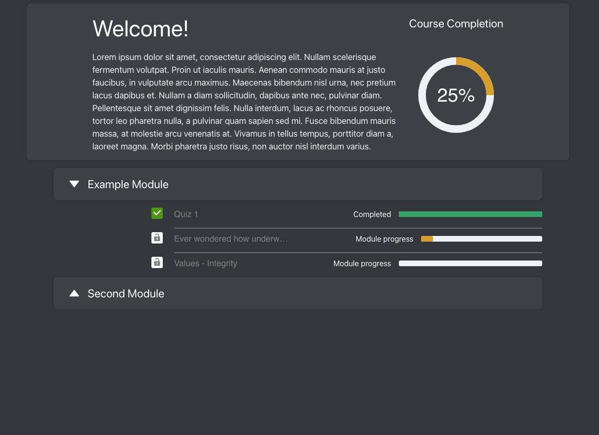

# toynet-featureset
Manual Unit-tests for ToyNet to be executed before merging master branch to production branch of https://github.com/Project-Reclass/toynet-react.
GIFs are captured using Giphy Capture on Mac OS.

## Splash screen navigates correctly

1. Click "Home" link in top menu. The page should automatically scroll to hide the menu.
2. Click "About" link in top menu. The page should automatically scroll past "Why Toynet?" to "About Project Reclass"
3. Click "Contact" link in top menu. The page should automatically scroll to the bottom.
4. Click "Learn more" button under "About Project Reclass". The browser should reroute to our front page (www.projectreclass.org).
5. Click "Try it" at the top. The browser should route to the emulator (https://toynet.projectreclass.org/module/1/emulator/1)

## Emulator components are functional

1. Add a switch and connect it to a router. Image panel should update once link is made (and not before).
2. Add a host and connect it to a switch. Image panel should update once link is made (and not before).
3. Able to switch to "Console" Tab which says "Coming soon..."
4. Able to switch to "History" Tab which says "Coming soon..."

## Image panel controls

1. Click center button (bottom) brings the image to the center of the image panel
2. Click plus button (top) to zoom in.
3. Click minus button (second from top) to zoom out.
4. Drag image around with the mouse. Image should follow mouse.
5. Cick eye button with a diagonal line across it (second from bottom) to make image invisible. Button icon should lose the diagonal line.
6. Click center button to center and bring back visibility (or eye button to just bring back visibility).

## Configuration tab controls

1. Add a router, a switch, and a host using the plus buttons.
2. Delete these devices using their associated trashcans.

1. Add a router, a swtich, and a host using the plus buttons.
2. Connect the new devices to each other.

Image panel should update regularly:

1. Delete link between r0 and s0.
2. Delete s2. This fails because h2 is connected to s2.
3. Delete link between s2 and h2.
4. Delete h2 with other trashcans. This fails.
5. Delete h2.

Image pnael should update regularly:

1. Adding more than 10 of any device should fail with error message: "Error: Maximum number of devices is 10!"

## Value Page Guideline

1. The path for the value page is "/value/{value_id}". For example, for value id 5003, the page for value Honor shows up. For 5001, Integrity shows up.
2. The page displays 1 to 3 boxes with the definition of the value from each military branch. In each box, the branch and the definition used by the branch are shown.
3. Under these boxes there is an input box written "What does {value} mean to you?" (For example, "What does Integrity mean to you?" for the Integrity page with value id 5001.) Here you write what the value mean to you.
4. Click "Save" beneath the input box to save the your response.

## Curriculum

1.  Items that are 100% completed should say "Completed" and progress bar should be green with a checkbox for icon.
2. Items that are not < 100% complete should say "Module progress" and the progress bar should be yellow/
3. Clicking on chevrons expand and minimize the list of modules.
